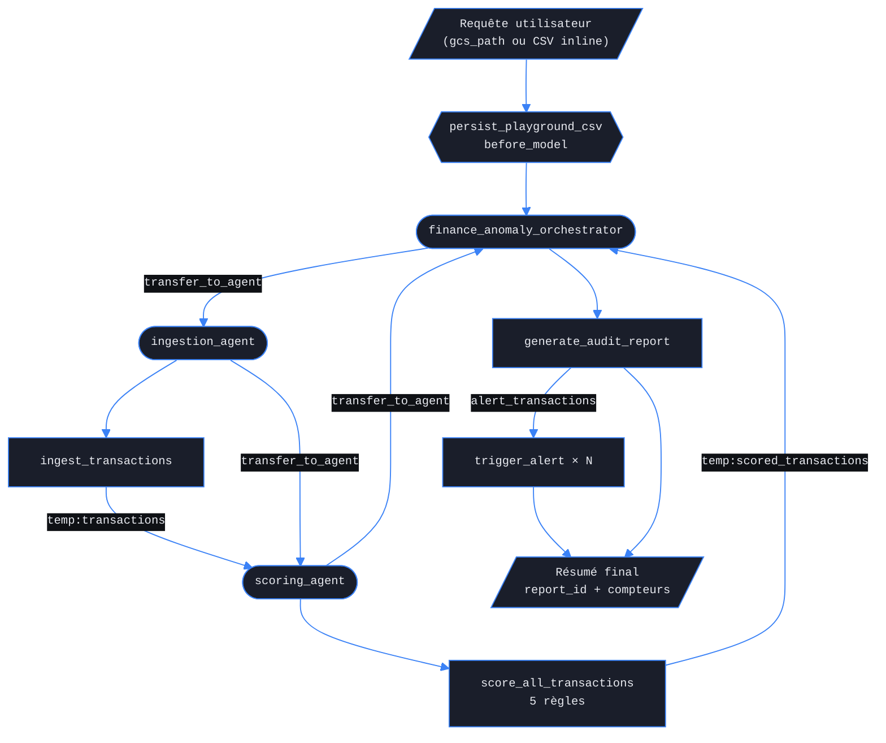
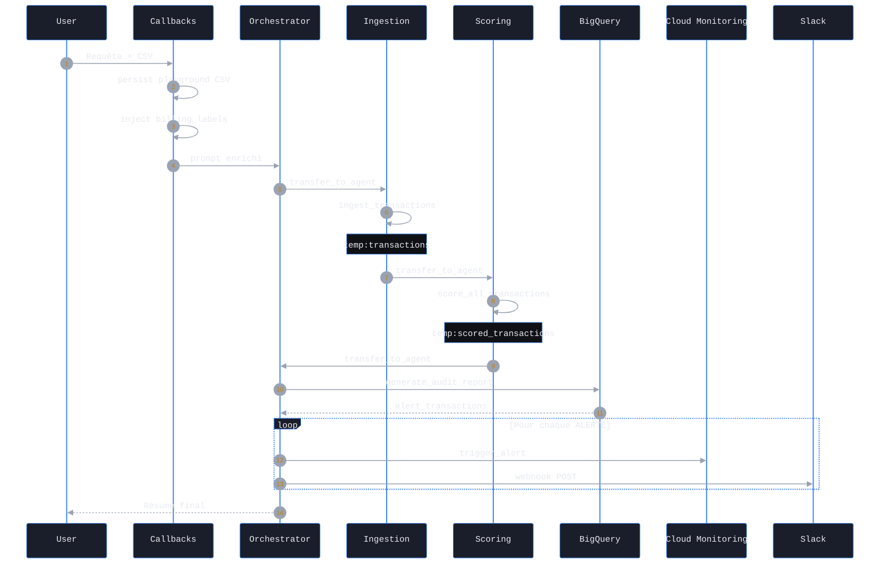
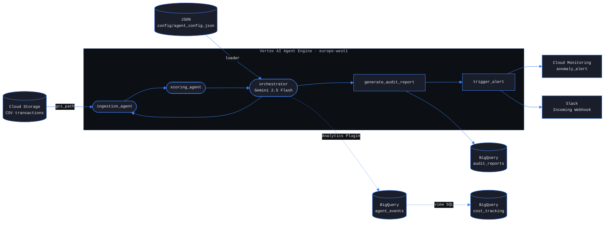
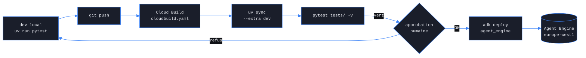

# ARCHITECTURE — Kairosium Finance Anomaly Agent

_Généré par adk-architect. Ne pas éditer manuellement._

**Repo :** `kairosium-finance-anomaly-agent` — pipeline multi-agents ADK (1 orchestrateur + 2 sous-agents) déployé sur Vertex AI Agent Engine `europe-west1`. Document architectural rétroactif : décrit le système tel qu'il existe dans le code (`orchestrator/`, `ingestion_agent/`, `scoring_agent/`, `shared/`, `config/`).

---

## Bloc 1 — Fonctionnement

Le pipeline ingère un CSV de transactions, applique 5 règles déterministes, persiste un rapport d'audit BigQuery et émet une alerte Cloud Monitoring + Slack par transaction ALERTE.

### Flux de traitement principal

### Agents ADK

| Agent | Type ADK | `output_key` | Dépend de |
|---|---|---|---|
| `finance_anomaly_orchestrator` | `Agent` (root) | — (état via tools) | `ingestion_agent`, `scoring_agent`, `generate_audit_report`, `trigger_alert` |
| `ingestion_agent` | `Agent` (sub) | — (écrit `temp:transactions`) | `ingest_transactions` |
| `scoring_agent` | `Agent` (sub) | — (écrit `temp:scored_transactions`) | `score_all_transactions`, `temp:transactions` |

### Fichiers cruciaux

| Fichier | Rôle dans ce projet |
|---|---|
| `orchestrator/agent.py` | Définit `root_agent`, branche callbacks et sub-agents |
| `orchestrator/app.py` | `App` ADK + `BigQueryAgentAnalyticsPlugin` + init OTEL |
| `orchestrator/tools/report.py` | Agrège les ScoredTransaction, écrit `audit_reports` |
| `orchestrator/tools/alert.py` | TimeSeries Cloud Monitoring + POST Slack webhook |
| `orchestrator/inline_csv.py` | Callback : matérialise un CSV inline du Dev UI sous `/tmp` |
| `ingestion_agent/agent.py` | Sous-agent ingestion, force `transfer_to_agent('scoring_agent')` |
| `ingestion_agent/tools/ingest.py` | Lecture GCS / local, validation schéma, sérialisation |
| `scoring_agent/agent.py` | Sous-agent scoring, force `transfer_to_agent('orchestrator')` |
| `scoring_agent/tools/score.py` | Implémente les 5 règles déterministes |
| `shared/models.py` | Pydantic `Transaction`, `ScoredTransaction`, `AuditReport`, `AgentConfig` |
| `shared/vertex_billing_labels.py` | Callback : injecte labels facturation Vertex |
| `config/agent_config.json` | Modèle, seuils, supplier_registry (50 entrées) |
| `config/loader.py` | Charge JSON + overrides env `MODEL_ID` / `BQ_DATASET_ID` |
| `infra/bigquery_schema.json` | Schéma déclaratif `cost_tracking` |

### Échanges inter-agents et callbacks

---

## Bloc 2 — Infrastructure

Topologie GCP : un service Vertex AI Agent Engine (`europe-west1`) lit Cloud Storage, écrit BigQuery `agent_prod` et Cloud Monitoring, et notifie Slack via webhook HTTP.

### Services GCP et liaisons

### Services GCP

| Service | Utilité dans ce cas |
|---|---|
| Vertex AI Agent Engine | Hébergement runtime du pipeline ADK |
| Vertex AI Gemini 2.5 Flash | Modèle LLM des 3 agents |
| Cloud Storage | Source CSV transactions (`gs://`) |
| BigQuery `audit_reports` | Persistance rapports audit |
| BigQuery `agent_events` | Événements agent (plugin Analytics) |
| BigQuery `cost_tracking` | Vue agrégée tokens et coûts |
| Cloud Monitoring | Métrique custom `anomaly_alert` |
| Cloud Logging | Logs runtime Agent Engine |
| Slack Incoming Webhook | Notification opérationnelle alertes |
| IAM ADC | Authentification sans clé API |

### Variables d'environnement

| Variable | Valeur attendue | Utilité dans ce cas |
|---|---|---|
| `GOOGLE_GENAI_USE_VERTEXAI` | `True` | Bascule ADK sur backend Vertex |
| `GOOGLE_CLOUD_PROJECT` | ID projet GCP | Active BQ, Monitoring, Storage |
| `GOOGLE_CLOUD_LOCATION` | `europe-west1` | Région Vertex et BQ |
| `BQ_DATASET_ID` | `agent_prod` | Override dataset cible |
| `MODEL_ID` | `gemini-2.5-flash` | Override modèle config JSON |
| `SLACK_WEBHOOK_URL` | URL webhook Slack | Active notifications alertes |
| `PIPELINE_ENVIRONMENT` | `dev` ou `prod` | Label facturation Vertex |

---

## Bloc 3 — Opérations

Tests pytest locaux et Cloud Build CI ; déploiement Agent Engine manuel uniquement (Make target bloqué pour exiger une approbation humaine explicite).

### Pipeline CI/CD

### Make targets

| Target | Ce que ça fait |
|---|---|
| `make playground` | Lance `adk web .` en local |
| `make test` | pytest + JUnit XML + import BQ `test_runs` |
| `make eval` | `adk eval` sur `eval/evalset.json` |
| `make lint` | `ruff check .` |
| `make generate-golden-set` | Régénère 250 transactions synthétiques |
| `make deploy` | Bloqué `exit 1` — approbation humaine requise |
