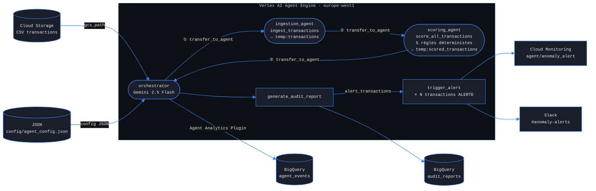

# Kairosium — Finance Anomaly Agent (ADK)

Pipeline multi-agents (NovaPay) : ingestion CSV, scoring, rapport d’audit, alertes.

## Problème métier résolu

Une PME SaaS mobilisait 2 ETP par semaine pour la revue manuelle des flux de paiement, avec des fraudes non détectées. Ce pipeline remplace le processus manuel par une analyse déterministe et LLM asynchrone, générant un rapport d’audit et des alertes en temps réel.

## Architecture



## KPIs mesurés

Comparaison des métriques entre exécution en **développement local** et en **production** (Agent Engine).

| Métrique | Objectif cible | Dév. local | Production | Verdict |
|:--|:--|:--|:--|:--|
| **Accuracy** | ≥ 85 % | 90 % | 90 % | ✅ |
| **Precision ALERTE** | — | 100 % | 100 % | ✅ |
| **Recall ALERTE** | — | 100 % | 100 % | ✅ |
| **Latence p95 tool call** | ≤ 3 000 ms | 637 ms | 455 ms | ✅ |
| **Alertes Cloud Monitoring** | 20 / 20 | 20 / 20 | 23 / 23 | ✅ |
| **Alertes Slack** | — | N/A | 23 messages | ✅ |
| **Tokens / run** | — | N/A | ~16 000 (~0,05 USD) | ✅ |
| **Modèle** | gemini-2.5-flash | gemini-2.0-flash | gemini-2.5-flash | ✅ |

**Note :** Precision / Recall sur un jeu d’évaluation **fixe** (250 transactions, 23 marquées ALERTE) **conforme** aux règles déterministes du scorer. Le premier jeu d’exemples était incohérent avec ces règles ; il a été recalé avant d’en faire la baseline de référence.

## Modèle LLM

- **Production :** `gemini-2.5-flash` (Vertex AI Gemini API), configuré via `config/agent_config.json` et surcharge possible par la variable d’environnement `MODEL_ID`.
- **Migration :** passage **`gemini-2.0-flash` → `gemini-2.5-flash`** aligné sur l’arrêt annoncé de **Gemini 2.0 Flash** (**1er juin 2026**). Ne pas réintroduire `gemini-2.0-flash` dans la config de production après cette date.
- **Authentification :** **Vertex AI avec ADC** (`gcloud auth application-default login`, `GOOGLE_GENAI_USE_VERTEXAI=true`) — **pas** de clé API Google AI Studio en mode production.

## Déploiement production

- **Méthode :** **Vertex AI Agent Engine**, région **`europe-west1`** (décision **ADR-007**).
- **Guide détaillé :** [`DEPLOY_AGENT_ENGINE.md`](DEPLOY_AGENT_ENGINE.md) (CLI `adk`, IAM BigQuery, vérification distante).

**Commande de déploiement (exemple) :**

```bash
cd kairosium-finance-anomaly-agent
uv run adk deploy agent_engine "$(pwd)" \
  --project "${GOOGLE_CLOUD_PROJECT}" \
  --region europe-west1 \
  --display_name "kairosium-finance-anomaly-agent" \
  --adk_app_object app \
  --trace_to_cloud
```

(Remplacez `--project` / `--display_name` selon votre environnement.)

**Suppression d’un Reasoning Engine :**

```bash
uv run python scripts/delete_reasoning_engine.py \
  "projects/PROJECT_ID/locations/europe-west1/reasoningEngines/ENGINE_ID"
```

## Cost tracking

**Pipeline observé en production :** labels Vertex AI (`GenerateContentConfig.labels`, via `shared/vertex_billing_labels.py`) → agrégation consommation depuis **`agent_events`** (plugin BigQuery Agent Analytics) → table matérialisée **`cost_tracking`** via la requête [`infra/cost_tracking.sql`](infra/cost_tracking.sql). **Fallback :** la vue **`v_llm_response`** n’était pas disponible telle quelle en prod ; le chemin retenu s’appuie sur les événements / agrégations documentés dans le SQL (voir commentaires `agent_events` dans le même fichier).

**Mesure (jeu d’évaluation, run de référence) :** ~**16 000** tokens, **< 0,05 USD** (ordre de grandeur cohérent avec l’estimation documentée dans `cost_tracking.sql`).

**Exemple de requête (adapter `PROJECT` / dataset) :**

```sql
SELECT *
FROM `PROJECT.agent_prod.cost_tracking`
ORDER BY window_start DESC
LIMIT 10;
```

Si la table a été créée avec le script versionné `infra/cost_tracking.sql`, les colonnes incluent notamment **`run_date`** (agrégat par jour) et il n’y a pas de colonne `window_start` : utiliser par exemple `ORDER BY run_date DESC`.

## Alertes Slack

Notifications **Slack** via **webhook HTTP** directement dans l’outil **`trigger_alert`** (`orchestrator/tools/alert.py`, variable `SLACK_WEBHOOK_URL`) — **pas** d’intégration Slack nativement pilotée par Cloud Monitoring pour ce flux (les politiques Monitoring restent sur les métriques `anomaly_alert` / latences).

## Décisions d’architecture (ADRs)

| ADR | Sujet | Fichier |
|:--|:--|:--|
| **ADR-005** | CI Cloud Build (niveau d’automatisation) | [`docs/adr/ADR-005.md`](docs/adr/ADR-005.md) |
| **ADR-006** | Firestore exclu (config versionnée) | [`docs/adr/ADR-006-firestore-exclusion.md`](docs/adr/ADR-006-firestore-exclusion.md) |
| **ADR-007** | Agent Engine (`europe-west1`) vs Cloud Run | [`docs/adr/ADR-007-agent-engine-vs-cloud-run.md`](docs/adr/ADR-007-agent-engine-vs-cloud-run.md) |
| **ADR-008** | MCP exclu (tools GCP natifs) | [`docs/adr/ADR-008-mcp-exclu.md`](docs/adr/ADR-008-mcp-exclu.md) |
| **ADR-009** | Google ADK comme framework | [`docs/adr/ADR-009-framework-adk.md`](docs/adr/ADR-009-framework-adk.md) |
| **ADR-010** | Modèle `gemini-2.5-flash` (Vertex) | [`docs/adr/ADR-010-modele-vertex-gemini.md`](docs/adr/ADR-010-modele-vertex-gemini.md) |
| **ADR-011** | Mono-repo multi-agents vs microservices | [`docs/adr/ADR-011-architecture-mono-repo-multi-agents.md`](docs/adr/ADR-011-architecture-mono-repo-multi-agents.md) |
| *Index* | Contexte 001–011 | [`docs/adr/README.md`](docs/adr/README.md) |

## CI (Cloud Build)

Fichier [`cloudbuild.yaml`](cloudbuild.yaml) : exécution de la suite ciblant la non-régression sur le jeu d’évaluation d’accuracy (`pytest tests/test_agent.py::test_accuracy_golden_set`). Détails dans **ADR-005**. Pour activer la CI bloquante sur le projet GCP, configurer un trigger `gcloud builds` pointant sur ce dépôt.
