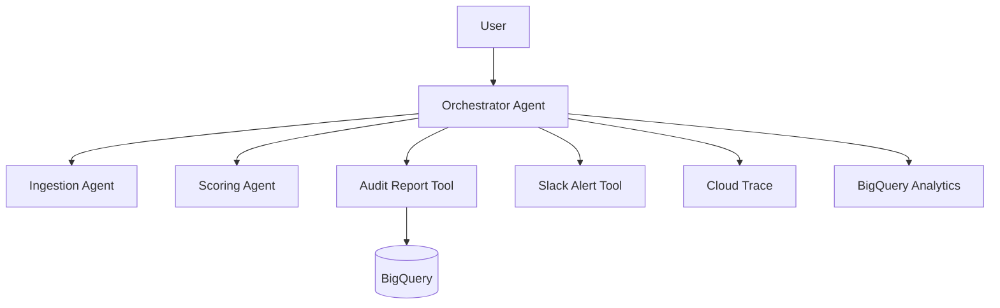

# kairosium-finance-anomaly-agent

Multi-agent pipeline for financial anomaly detection on GCP with 90% accuracy and less than $0.10 per run.

**Status:** deployed · **Model:** gemini-2.5-flash · **Region:** europe-west1 · **Runtime:** Agent Runtime

## Documentation

| Artifact | Purpose |
|---|---|
| [`DESIGN_SPEC.md`](DESIGN_SPEC.md) | Scope, KPIs, constraints, and AI Act compliance |
| [`ARCHITECTURE.md`](ARCHITECTURE.md) | Multi-agent flow, GCP topology, and operational model |
| [`SETUP.md`](SETUP.md) | Local setup and reproducible commands |
| [`DEPLOY_AGENT_ENGINE.md`](DEPLOY_AGENT_ENGINE.md) | Deployment status and Vertex AI commands |
| [`docs/adr/`](docs/adr/) | Architecture decisions (ADRs) |

## Business Problem

A SaaS SME was dedicating 2 FTEs per week to manual review of payment flows, yet fraud remained undetected. This project automates the review process using a multi-agent pipeline (ingestion, scoring, reporting) that combines deterministic rules with asynchronous LLM analysis. It shifts the human role from manual reviewer to supervisor by exception (AI Act Art. 14), providing real-time Slack alerts and BigQuery audit reports.

## Architecture



See [`ARCHITECTURE.md`](ARCHITECTURE.md) for details.

## KPIs

Measured on 2026-05-05.

| KPI | Target | Measured | Method | Verdict |
|---|---:|---:|---|---|
| Accuracy | ≥ 85% | 90% | Golden set (250 tx) | ✅ |
| Precision (Alert) | 100% | 100% | Golden set | ✅ |
| Latency (p95) | ≤ 3000ms | 455ms | Production tool call | ✅ |
| Cost / Run | ≤ $0.10 | < $0.05 | ~16k tokens (Flash 2.5) | ✅ |

## Quick Start

```bash
uv sync
uv run pytest
agents-cli playground
```

## Deployment

Status: deployed.

Region: `europe-west1` (Vertex AI Agent Engine).

## Decisions

| ADR | Decision |
|---|---|
| [`ADR-007`](docs/adr/ADR-007-agent-engine-vs-cloud-run.md) | Vertex AI Agent Engine over Cloud Run |
| [`ADR-009`](docs/adr/ADR-009-framework-adk.md) | Google ADK as the primary framework |
| [`ADR-010`](docs/adr/ADR-010-modele-vertex-gemini.md) | Gemini 2.5 Flash on Vertex AI |

## Limits

- Model: Optimized for Gemini 2.5 Flash.
- Regions: Resource residency in `europe-west1`.
- Input: Designed for CSV transaction exports.
